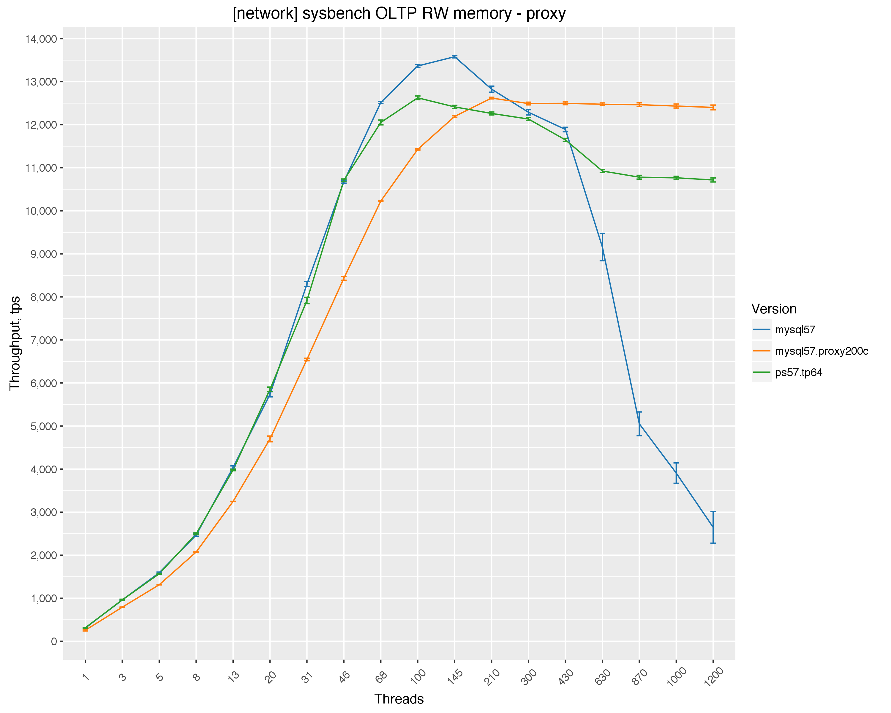

MySQL 5.7 - OLTP RW, ProxySQL and PS thread pool
================================================

Setup
-----

-   Client (sysbench) and server are on different servers, connected via 10Gb network.
-   CPU: 56 logical CPU threads servers Intel(R) Xeon(R) CPU E5-2683 v3 @ 2.00GHz
-   sysbench 10 tables x 10mln rows, pareto distribution
-   OS: Ubuntu 15.10 (Wily Werewolf)
-   Kernel 4.2.0-30-generic
-   Storage device is Samsung SM863 SATA SSD, single device, with ext4 filesystem

Results
-------

